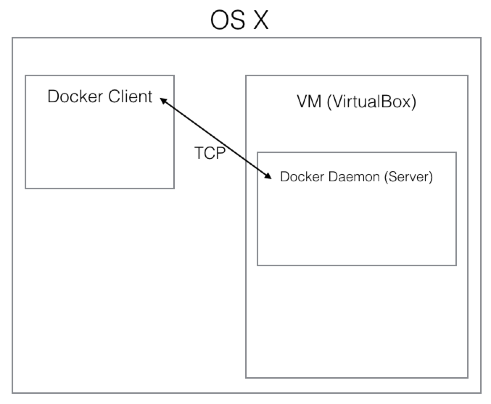

# Docker local setup

## How Docker on OS X works? (use VirtualBox)

Docker is a linux only technology (mostly). OS X doesn't support containers.



## Setup local docker server (docker-machine)

### >>Hands on<<

1. Install docker-machine

    ```
    brew update
    brew install docker-machine
    ```

2. Create a machine called `docker-training`

    ```
    docker-machine create --driver virtualbox docker-training
    ```

3. Let's first look inside the docker-machine

    ```sh
    docker-machine ssh docker-training

    # If not configured, docker will listen to request from this socket file
    # Imagine this is a API server
    ll /var/run/docker.sock
    ```

4. Work with docker locally

    ```sh
    env | grep DOCKER
    # See nothing

    # Docker can also communicate through networks
    eval $(docker-machine env docker-training)

    env | grep DOCKER
    # Should see DOCKER_HOST=tcp://192.168.99.101:2376
    ```
